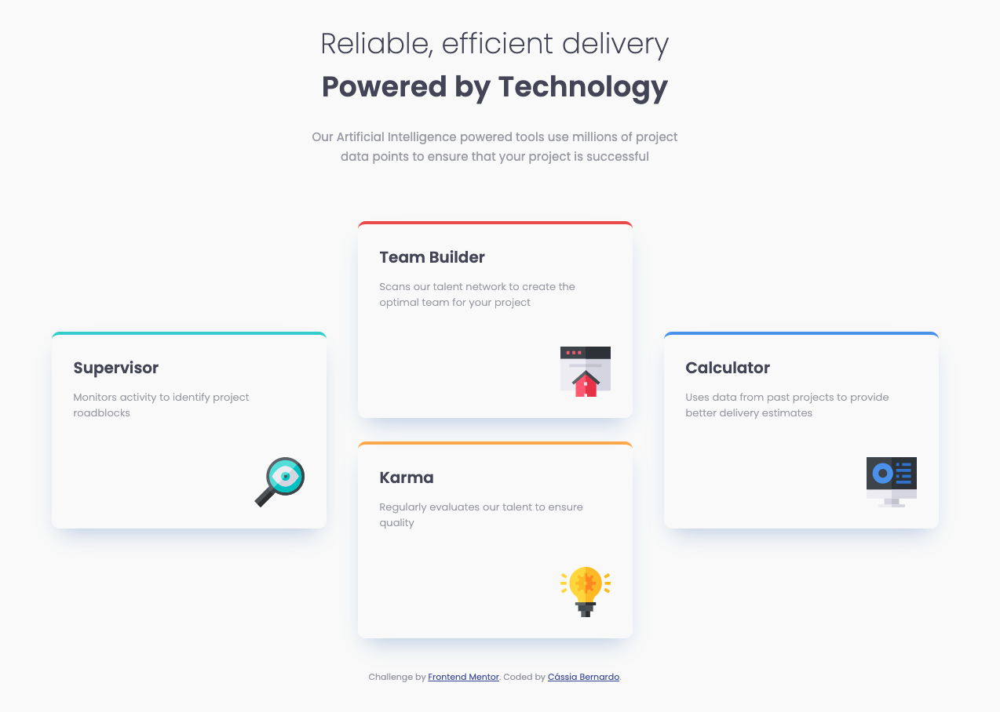

# Frontend Mentor - Four card feature section solution

This is a solution to the [Four card feature section challenge on Frontend Mentor](https://www.frontendmentor.io/challenges/four-card-feature-section-weK1eFYK). Frontend Mentor challenges help you improve your coding skills by building realistic projects. 

## Table of contents

- [Overview](#overview)
  - [The challenge](#the-challenge)
  - [Screenshot](#screenshot)
  - [Links](#links)
- [My process](#my-process)
  - [Built with](#built-with)
  - [What I learned](#what-i-learned)
  - [Useful resources](#useful-resources)
- [Author](#author)

## Overview

### The challenge

Users should be able to:

- View the optimal layout for the site depending on their device's screen size

### Screenshot

### Links

- Solution URL: [GitHub](https://github.com/cah90/four-card-feature-seaction-master)
- Live Site URL: [Git Pages](https://cah90.github.io/four-card-feature-seaction-master/)

## My process

### Built with

- Semantic HTML5 markup
- CSS custom properties
- CSS Grid
- CSS Grid Area
- Mobile-first workflow

### What I learned

I used this challenge to recap Semantic HTML5 markup, CSS properties, CSS Grid while working through this project. 

### Useful resources

- [W3 Schools](https://www.w3schools.com/cssref/pr_grid-area.asp) - This helped me to recap and understand better about grid-area properties.
- [W3 Schools](https://www.w3schools.com/cssref/pr_grid-template-areas.asp) - This helped me to recap and understand better about grid-area properties.

## Author

- Website - (https://cassiabernardo.com)
- Frontend Mentor - [@cah90](https://www.frontendmentor.io/profile/cah90)

